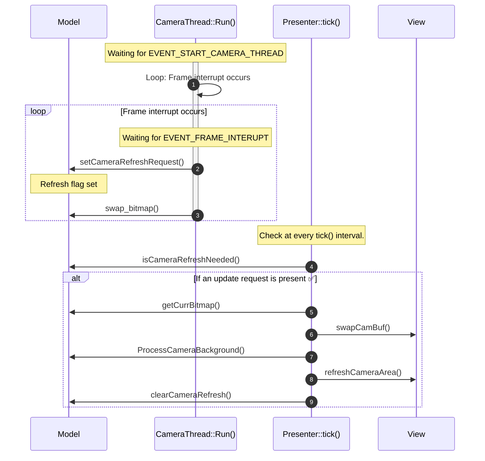
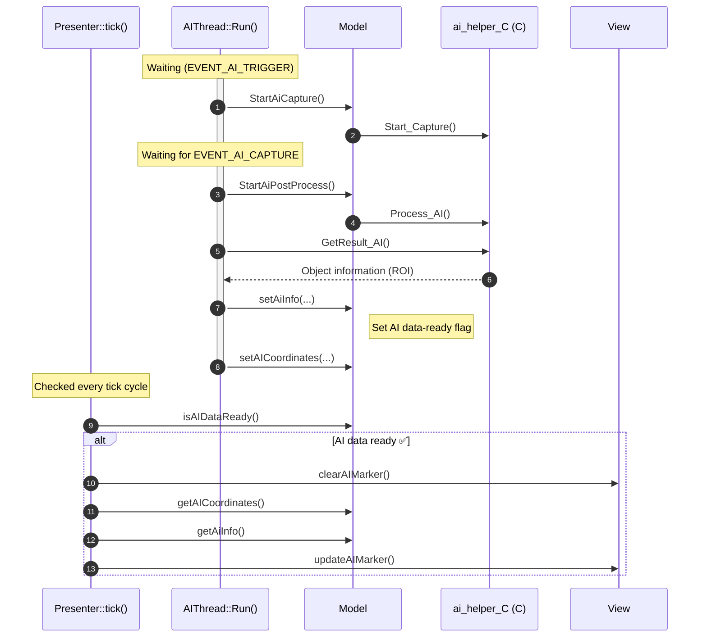
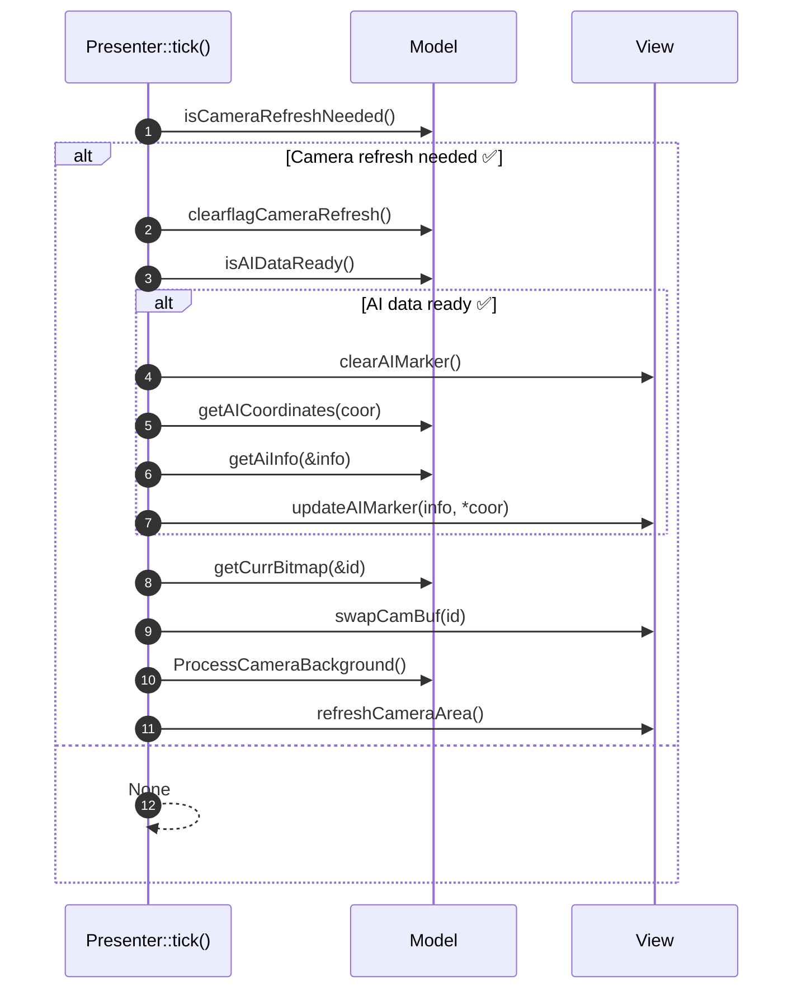
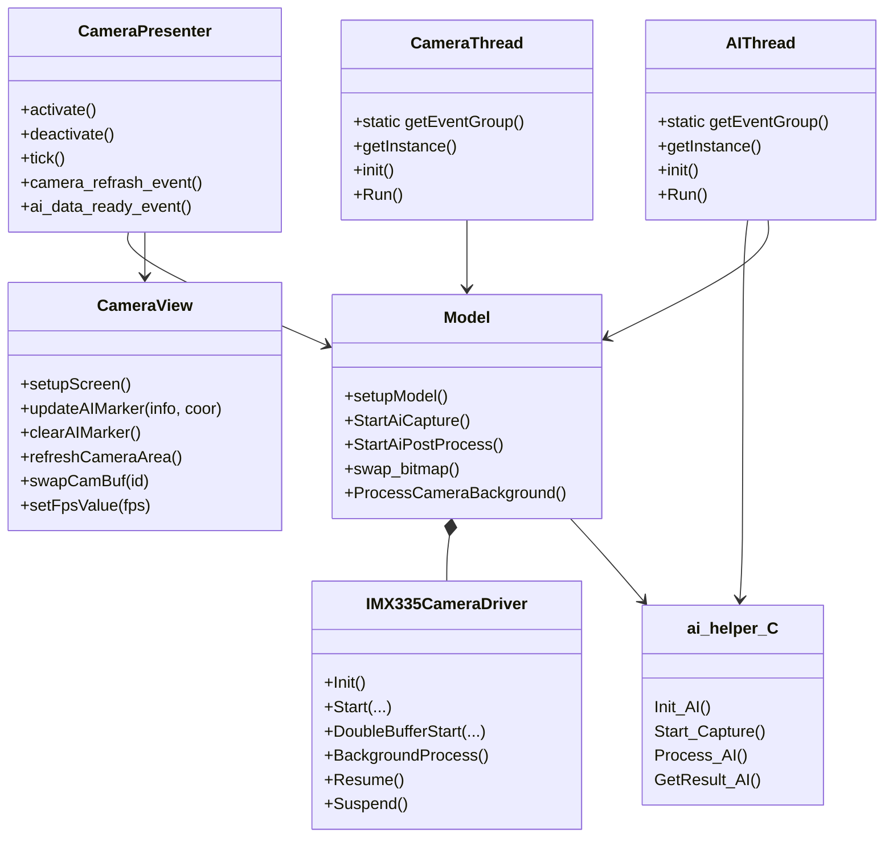

Example Image

#  Development Environment

- **Board**:  STM32N6570-DK (Discovery Kit)
- **IDE**:  IAR Embedded Workbench / TouchGFX Designer
- **RTOS**:  Azure RTOS ThreadX
- **Toolchain**:  IAR ARM Compiler (EWARM)
- **Graphics Framework**:  TouchGFX

# Execution Steps

1. Connect the `STM32N6570-DK` to the PC and set Boot1 to High.
2. Open `EWARM/Project.eww`.
3. Build both `STM32N6570-DK_Appli` & `STM32N6570-DK_FSBL` projects.
4. Navigate to the `Flash scripts/IAR` directory.
5. Execute `SignAndLoad_App.bat` & `SignAndLoad_FSBL.bat` scripts.
6. Set **Boot1** to Low and perform a Reset.

# Camera Module

**Overview**

- The **CameraThread** is responsible for handling camera frame processing.
- When the **EVENT_START_CAMERA_THREAD** event is triggered, the CameraThread is initiated.
- For every **EVENT_FRAME_INTERRUPT** event, a new camera frame is ready:
    - The Model notifies the Presenter to update the camera feed.
    - `swap_bitmap()` is called to handle double-buffering.
- The Presenter detects the model state changes in its `tick()` method and updates the View accordingly.

### Sequence Diagram

# AI

**Overview**

In this project, AI processing is performed in a dedicated thread (`AIThread`).
After the camera captures an image, the AI thread analyzes it to obtain object-recognition results, passes those results to the `Model`, and prepares them so the `View` can display them.
- AIThread operates on an event basis (`EVENT_AI_TRIGGER`, `EVENT_AI_CAPTURE`).
- The AI logic calls an external C library (`ai_helper_C`).
- The resulting ROI information is sent to the `Model`, and the `View` visualizes it with markers.

### Sequence Diagram

# MVP Pattern

| Component | Responsibility |
| --- | --- |
| **Model** | Core logic (AI processing, camera control, data handling, etc.) |
| **Presenter** | In periodic functions such as `tick()`, checks `Model` state and forwards it to the `View` |
| **View** | Updates the screen and handles the UI shown to the user |

# Class Diagram

