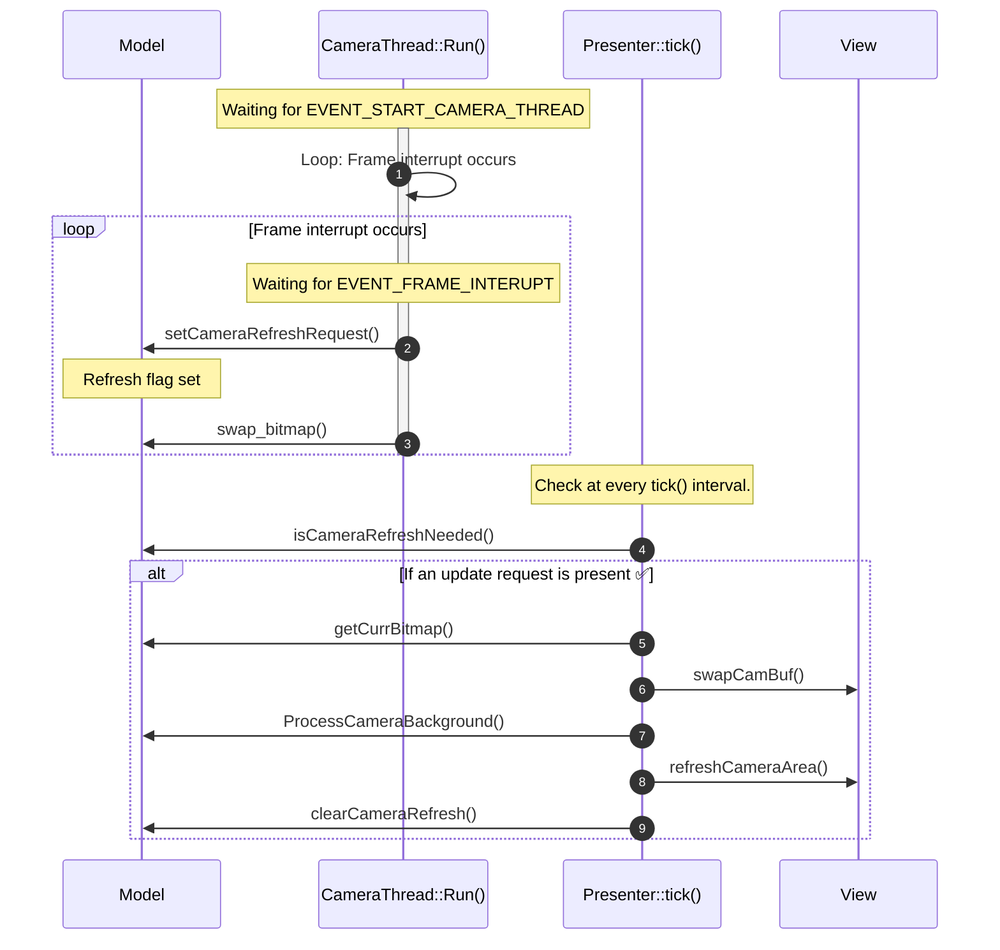
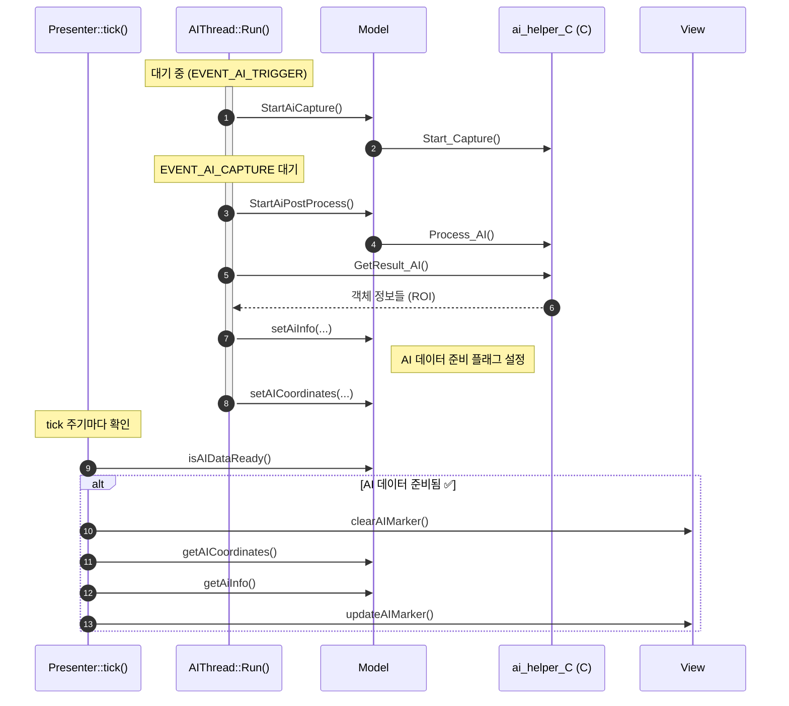
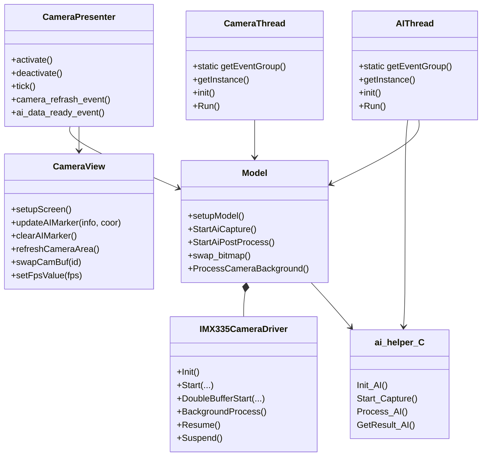

Example Image

#  Development Environment

- **Board**:  STM32N6570-DK (Discovery Kit)
- **IDE**:  IAR Embedded Workbench / TouchGFX Designer
- **RTOS**:  Azure RTOS ThreadX
- **Toolchain**:  IAR ARM Compiler (EWARM)
- **Graphics Framework**:  TouchGFX

# Execution Steps

1. Connect the `STM32N6570-DK` to the PC and set Boot1 to High.
2. Open `EWARM/Project.eww`.
3. Build both `STM32N6570-DK_Appli` & `STM32N6570-DK_FSBL` projects.
4. Navigate to the `Flash scripts/IAR` directory.
5. Execute `SignAndLoad_App.bat` & `SignAndLoad_FSBL.bat` scripts.
6. Set **Boot1** to Low and perform a Reset.

# Camera Module

**Overview**

- The **CameraThread** is responsible for handling camera frame processing.
- When the **EVENT_START_CAMERA_THREAD** event is triggered, the CameraThread is initiated.
- For every **EVENT_FRAME_INTERRUPT** event, a new camera frame is ready:
    - The Model notifies the Presenter to update the camera feed.
    - `swap_bitmap()` is called to handle double-buffering.
- The Presenter detects the model state changes in its `tick()` method and updates the View accordingly.

### Sequence Diagram

# AI

**개요**

이 프로젝트에서 **AI 처리**는 별도의 스레드(`AIThread`)에서 수행됩니다.

카메라에서 이미지를 캡처한 후, AI 스레드는 이를 분석하여 객체 인식 결과를 얻고, 결과를 `Model`에 전달하여 화면에 표시할 수 있도록 준비합니다.

- **AIThread**는 이벤트 기반으로 동작합니다 (`EVENT_AI_TRIGGER`, `EVENT_AI_CAPTURE`).
- AI 처리 로직은 외부 C 라이브러리 (`ai_helper_C`)를 호출합니다.
- 결과로 얻은 ROI 정보를 Model에 전달하고, View에서 이를 마커로 시각화합니다.

**시퀸스 다이어그램**

# MVP Pattern

| 구성 요소 | 담당 역할 |
| --- | --- |
| **Model** | 로직 처리 (AI 처리, 카메라, 데이터 핸들링 등) |
| **Presenter** | `tick()` 같은 주기 함수에서 Model의 상태 확인 및 View에 전달 |
| **View** | 화면 갱신 및 유저에게 보여지는 UI 처리 |

# 클래스 다이어그램

