예시 이미지

# 🛠️ 개발 환경

- **Board**:  STM32N6570-DK (Discovery Kit)
- **IDE**:  IAR Embedded Workbench / TouchGFX Designer
- **RTOS**:  Azure RTOS ThreadX
- **Toolchain**:  IAR ARM Compiler (EWARM)
- **Graphics Framework**:  TouchGFX

# 🚀 실행 방법

1. STM32N6570-DK을 PC에 연결 후, Boot1을 High로 설정
2. EWARM/Project.eww 실행
3. `STM32N6570-DK_Appli` & `STM32N6570-DK_Appli` 각각 Build
4. Flash scripts/IAR로 이동
5. `SignAndLoad_App.bat` & `SignAndLoad_FSBL.bat` 스크립트 실행
6. Boot1을 Low로 설정 후, Reset 실행

# 📷 Camera

**개요**

- **CameraThread**는 카메라 프레임 처리를 전담하는 스레드입니다.
- **EVENT_START_CAMERA_THREAD** 이벤트가 발생하면 카메라 스레드가 시작됩니다.
- 이후 **EVENT_FRAME_INTERUPT** 이벤트마다 카메라 프레임이 준비되었음을 의미하며,
    - Model을 통해 Presenter에게 **카메라 갱신 요청**을 전달합니다.
    - `swap_bitmap()`을 호출해 더블 버퍼 처리도 함께 수행합니다.
- Presenter는 `tick()`에서 모델의 상태를 감지해 View를 갱신합니다.

**시퀸스 다이어그램**

```mermaid
sequenceDiagram
    autonumber
    participant Model as Model
    participant CameraThread as CameraThread::Run()
    participant Presenter as Presenter::tick()
    participant View as View

    Note over CameraThread: EVENT_START_CAMERA_THREAD 대기 중
    activate CameraThread
    CameraThread->>CameraThread: 이벤트 수신 후 루프 진입

    loop 프레임 인터럽트 발생
        Note over CameraThread: EVENT_FRAME_INTERUPT 대기
        CameraThread->>Model: setCameraRefreshRequest()
        Note over Model: Refresh flag set
        CameraThread->>Model: swap_bitmap()
    end

    deactivate CameraThread

    Note over Presenter: tick() 주기마다 확인
    Presenter->>Model: isCameraRefreshNeeded()
    alt 갱신 요청 있음 ✅
        Presenter->>Model: getCurrBitmap()
        Presenter->>View: swapCamBuf()
        Presenter->>Model: ProcessCameraBackground()
        Presenter->>View: refreshCameraArea()
        Presenter->>Model: clearCameraRefresh()
    end

```

# 🧠 AI

**개요**

이 프로젝트에서 **AI 처리**는 별도의 스레드(`AIThread`)에서 수행됩니다.

카메라에서 이미지를 캡처한 후, AI 스레드는 이를 분석하여 객체 인식 결과를 얻고, 결과를 `Model`에 전달하여 화면에 표시할 수 있도록 준비합니다.

- **AIThread**는 이벤트 기반으로 동작합니다 (`EVENT_AI_TRIGGER`, `EVENT_AI_CAPTURE`).
- AI 처리 로직은 외부 C 라이브러리 (`ai_helper_C`)를 호출합니다.
- 결과로 얻은 ROI 정보를 Model에 전달하고, View에서 이를 마커로 시각화합니다.

**시퀸스 다이어그램**

```mermaid
sequenceDiagram
    autonumber
    participant Presenter as Presenter::tick()
    participant AIThread as AIThread::Run()
    participant Model as Model
    participant AIHelper as ai_helper_C (C)
    participant View as View

    Note over AIThread: 대기 중 (EVENT_AI_TRIGGER)

    activate AIThread
    AIThread->>Model: StartAiCapture()
    Model->>AIHelper: Start_Capture()
    Note over AIThread: EVENT_AI_CAPTURE 대기

    AIThread->>Model: StartAiPostProcess()
    Model->>AIHelper: Process_AI()
    AIThread->>AIHelper: GetResult_AI()
    AIHelper-->>AIThread: 객체 정보들 (ROI)

    AIThread->>Model: setAiInfo(...)
    Note right of Model: AI 데이터 준비 플래그 설정
    AIThread->>Model: setAICoordinates(...)

    deactivate AIThread

    Note over Presenter: tick 주기마다 확인
    Presenter->>Model: isAIDataReady()
    alt AI 데이터 준비됨 ✅
        Presenter->>View: clearAIMarker()
        Presenter->>Model: getAICoordinates()
        Presenter->>Model: getAiInfo()
        Presenter->>View: updateAIMarker()
    end

```

# 🧩 MVP Pattern

| 구성 요소 | 담당 역할 |
| --- | --- |
| **Model** | 로직 처리 (AI 처리, 카메라, 데이터 핸들링 등) |
| **Presenter** | `tick()` 같은 주기 함수에서 Model의 상태 확인 및 View에 전달 |
| **View** | 화면 갱신 및 유저에게 보여지는 UI 처리 |

# 📦 클래스 다이어그램

